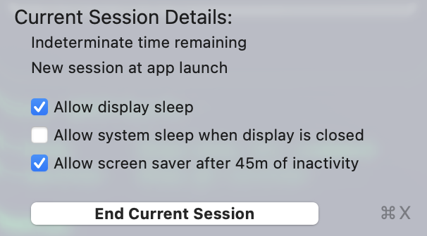
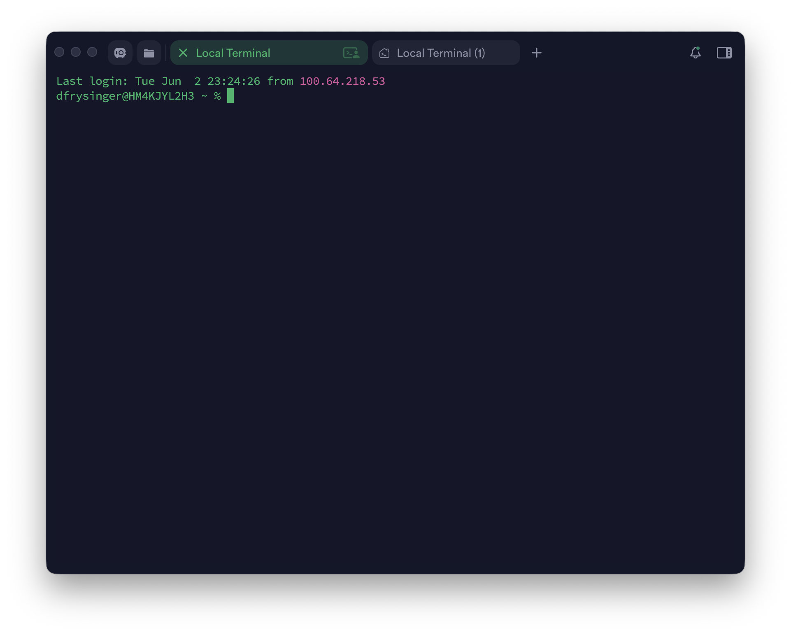
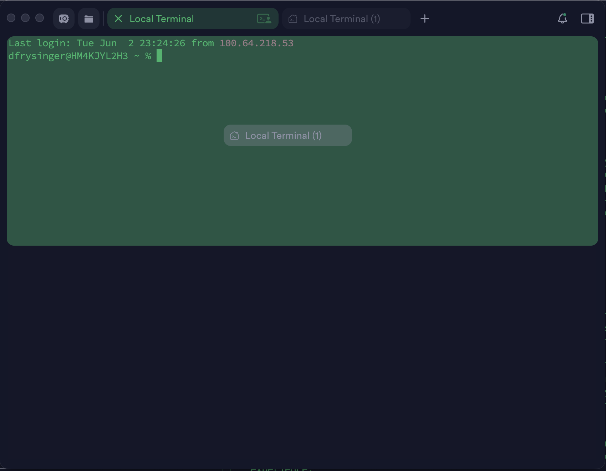
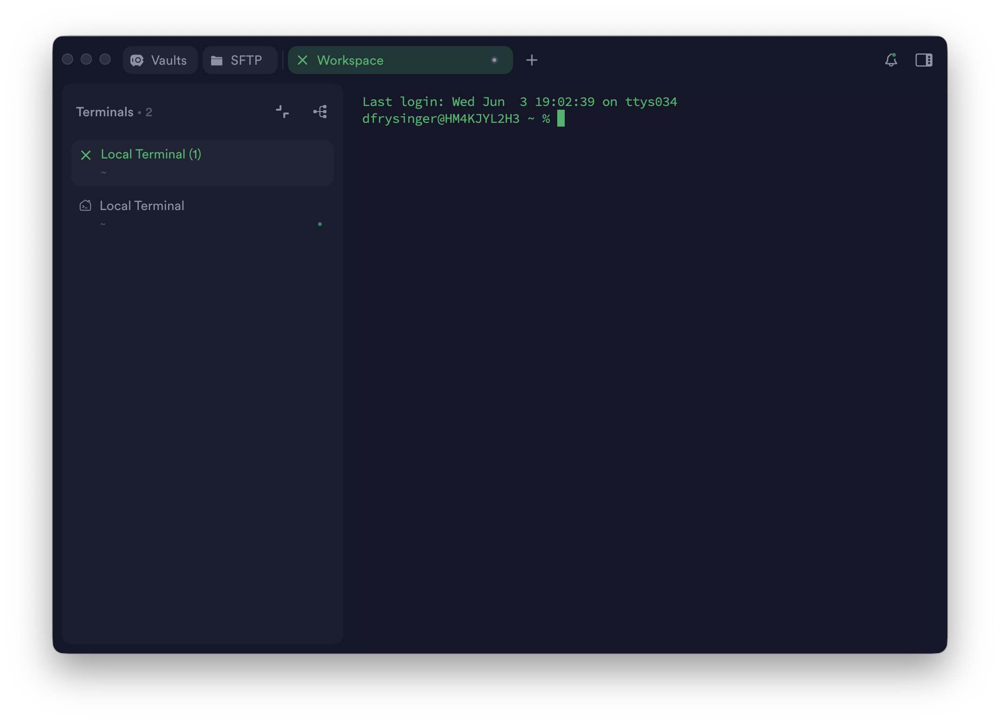

# remote-agent-stack

A macOS bootstrap that turns one Mac into a always-reachable host for
running named AI agent sessions — [GitHub Copilot
CLI](https://github.com/github/copilot-cli) and [Claude Code
CLI](https://docs.claude.com/en/docs/claude-code) are both first-class
backends, chosen per-command (`ca alpha` for Copilot, `cc alpha` for
Claude) — and reach them from any device (phone, tablet, another
laptop) over [Tailscale SSH](https://tailscale.com/kb/1193/tailscale-ssh)
and `tmux`, with [Termius](https://termius.com) as the terminal
client.

The end state: tap a host in Termius on your phone, land in the same
agent CLI conversation your laptop left mid-thought.

This README is the full setup walkthrough — fresh Mac to phone to
desktop. If you already have parts of this stack working, jump to the
section you need from the table of contents.

---

## Contents

1. [What you get](#what-you-get)
2. [How many agents?](#how-many-agents)
3. [Prerequisites](#prerequisites)
4. [Part 1 — Server Mac setup](#part-1--server-mac-setup)
5. [Part 2 — iPhone (Termius iOS)](#part-2--iphone-termius-ios)
6. [Part 3 — Mac desktop (Termius)](#part-3--mac-desktop-termius)
7. [Daily use](#daily-use)
8. [Configuration](#configuration)
9. [Uninstall](#uninstall)
10. [Status & roadmap](#status--roadmap)

---

## What you get

- A single multi-call wrapper (`bin/agent`) installed under four names
  — `ca` / `copilot-agent` for the Copilot backend, `cc` /
  `claude-agent` for the Claude Code backend — that launches or
  reattaches to a named agent session. Keychain unlock, `tmux` session
  management, and best-effort resumption of the previous CLI session
  for that name (Copilot: stable UUID via `--session-id`; Claude:
  `--continue` when the workspace has an existing session) are all
  handled.

  Each backend has its own workspace root and its own tmux session
  namespace, so the two never collide:
    - `ca alpha` → workspace `$COPILOT_WORKSPACE_BASE/agent-alpha`, tmux `alpha`
    - `cc alpha` → workspace `$CLAUDE_WORKSPACE_BASE/agent-alpha`,  tmux `claude-alpha`
- A one-shot installer for OS-level prerequisites: Homebrew, `tmux`,
  Tailscale (CLI build), and the MagicDNS resolver fix that Homebrew's
  Tailscale formula leaves out.
- A symmetric uninstaller.

## How many agents?

Pick whatever count fits your workflow. The author runs about a dozen
in practice — named after the [NATO phonetic
alphabet](https://en.wikipedia.org/wiki/NATO_phonetic_alphabet)
(`alpha`, `bravo`, `charlie`, `delta`, `echo`, `foxtrot`, `golf`,
`hotel`, `india`, `juliet`, `kilo`, `lima`). The `ca` script accepts
any string and prepends `agent-` to derive a workspace directory, so
`ca coordinator` or `ca planner` Just Work.

Names are **case-sensitive end-to-end** (`tmux` session, workspace
directory, Copilot CLI session name all match exactly what you type).
Pick a casing convention and stick with it. Lowercase is what we use.

## Prerequisites

- A Mac (Apple silicon, macOS Tahoe or newer; older versions probably
  work but aren't tested).
- A [Tailscale](https://tailscale.com) account (the free tier covers
  everything here).
- [Termius](https://termius.com/download) on every device you want to
  drive agents from. Termius **Pro** is recommended for the snippet
  features used in [Part 2](#part-2--iphone-termius-ios), but the
  whole stack also works on Termius Free if you're willing to type
  `ca alpha` after each connect.
- The **direct-download** Termius build on macOS — *not* the Mac App
  Store version, which is sandboxed and has no local-terminal feature.
  Download from <https://termius.com/download>.

---

## Part 1 — Server Mac setup

This is the Mac that will host the agent sessions. Everything in this
part runs once, on the Mac itself.

> **Auth model heads-up:** this stack uses [Tailscale
> SSH](https://tailscale.com/kb/1193/tailscale-ssh), which authenticates
> by tailnet identity — server-side, the SSH server uses auth method
> `none` and trusts the tailnet for identity. The username field on the
> host has to match a real macOS user that the ACL allows
> (`autogroup:nonroot` in the rule below means "any non-root user"). The
> password field can be left blank; if you do save a value, it's sent on
> the wire but ignored by the Tailscale SSH server.

### 1.1 — Tailscale account

If you already have a tailnet, skip ahead. Otherwise: sign up at
<https://login.tailscale.com/start> (free personal plan is enough),
then confirm **MagicDNS** is on at
<https://login.tailscale.com/admin/dns> (it's on by default for new
tailnets — just verify). The full Tailscale walkthrough is
[`docs/tailscale.md`](docs/tailscale.md).

### 1.2 — Keep the Mac awake

[Amphetamine](https://apps.apple.com/app/amphetamine/id937984704) (free,
Mac App Store) keeps the Mac from sleeping while still letting the
display sleep, the screensaver lock the screen per MDM policy, etc.

Recommended config (Amphetamine menu → Quick Settings):

- **Allow display sleep** — ON
- **Allow system sleep when display is closed** — OFF (keeps the Mac
  awake even with the lid down on a clamshell setup)
- **Allow screen saver after 45m of inactivity** — ON (so MDM lock
  policy still fires)
- **Start session at app launch** — ON, set to **Indefinitely**
- **Launch Amphetamine at login** — ON (System Settings → General →
  Login Items)

The result: rebooting the Mac auto-resumes an indefinite caffeine
session, the display still sleeps and locks, but the system never
suspends — so the tailnet stays online and `tmux` sessions stay alive.


### 1.3 — Clone and run the installer

```bash
git clone https://github.com/dfrysinger/remote-agent-stack \
  ~/code/remote-agent-stack
cd ~/code/remote-agent-stack
./install.sh
```

The installer is idempotent — safe to re-run. It:

- Installs Homebrew (if missing), `tmux`, and the Tailscale CLI build.
- Writes `/etc/resolver/ts.net` (the MagicDNS resolver fix).
- Symlinks four names into `/usr/local/bin` — `copilot-agent`,
  `ca`, `claude-agent`, `cc` — all pointing at the same multi-call
  wrapper (`bin/agent`).
- Stamps a managed block into `~/.tmux.conf` that hides tmux's status
  bar (the agents are full-screen TUIs and your Termius tabs already
  label each session). Toggle it back per-session with `prefix + b`.
  Any hand-written `~/.tmux.conf` you already have is preserved.
- Prints a checklist of the GUI / interactive steps it can't do for
  you — Full Disk Access grants (next step), `tailscale up --ssh`,
  first Copilot CLI auth prompt.

If you're driving the install **over VNC / Screens / Termius** —
anywhere the `sudo` prompt could be hard to see — use the GUI launcher
instead, which opens a fresh Terminal.app window where the password
prompt is obvious:

```bash
open ~/code/remote-agent-stack/install-gui.command
```

(Or double-click `install-gui.command` in Finder.)

### 1.4 — Full Disk Access

`tmux` and `tailscaled` both need Full Disk Access on macOS Ventura+.
Grant FDA **before** running `tailscale up --ssh` — `tailscaled`
without FDA can flap offline and DNS goes intermittent.

The installer printed the exact Cellar paths to add. See
[`docs/fda-grants.md`](docs/fda-grants.md) for the why and the
step-by-step. (After every `brew upgrade tmux` or `brew upgrade
tailscale`, the version-numbered Cellar path changes and you'll need
to re-add — annoying but unavoidable.)

### 1.5 — Authenticate Tailscale and turn on Tailscale SSH

```bash
sudo tailscale up --ssh
```

Open the auth URL it prints, sign into your Tailscale account, and
the Mac joins the tailnet. The `--ssh` flag tells `tailscaled` to bind
a Tailscale SSH server on `:22` (replacing macOS's built-in Remote
Login, which on a managed Mac MDM keeps disabling anyway).

### 1.6 — Add an SSH ACL rule

Tailscale SSH **only** binds `:22` if your tailnet ACL contains at
least one SSH rule that could apply to the node. Out of the box, new
tailnets have **zero** SSH rules — `:22` will refuse connections even
though `tailscale debug prefs` shows `RunSSH: true`. Edit your ACL at
<https://login.tailscale.com/admin/acls/file> and add:

```json
{
  "ssh": [
    {
      "action": "accept",
      "src":    ["autogroup:member"],
      "dst":    ["autogroup:self"],
      "users":  ["autogroup:nonroot"]
    }
  ]
}
```

`tailscaled` picks this up within seconds. Verify:

```bash
sudo tailscale debug netmap | python3 -c \
  'import json,sys; d=json.load(sys.stdin); p=d.get("SSHPolicy") or {}; \
   print("rules:", len(p.get("Rules",[])))'
```

`rules: 1` (or higher) means you're good. If it's still `0`, you saved
to the wrong tailnet or the ACL has a syntax error — see
[`docs/tailscale.md`](docs/tailscale.md).

### 1.7 — First backend CLI launch

Install whichever backend CLI(s) you plan to use:

- **Copilot CLI** — per [its own
  instructions](https://github.com/github/copilot-cli) (`brew install
  copilot-cli` works once it's published; otherwise follow the README
  there). The first launch asks:

  > System vault not available — store token in plain text config file?

  **Answer Yes.** The macOS keychain prompts the GUI for unlock, which
  there's nobody to dismiss when you're SSH'd in from a phone — the
  keychain stays locked and Copilot CLI stalls. The plaintext fallback
  lives at `~/.copilot/config.json` with mode `0600`, inside the
  FileVault-encrypted home volume. The risk delta over the keychain is
  small; the operational benefit (Copilot CLI just works over SSH) is
  large.

- **Claude Code CLI** — per [the Claude Code
  quickstart](https://docs.claude.com/en/docs/claude-code/quickstart).
  The first launch opens an in-terminal login flow — follow the
  prompts to authenticate; the token lands under `~/.claude/`.

You can install one, the other, or both. The wrapper enforces the
presence of the backend binary in PATH only at launch time.

### 1.8 — Workspace locations

Each backend has its own root directory; inside each, agents are
`agent-<name>/` subdirs (e.g., `agent-alpha/`, `agent-bravo/`). The
installer asks for both roots and auto-picks smart defaults:

- **With Dropbox installed** (recommended — workspaces sync across
  Macs):
  - Copilot: `~/Library/CloudStorage/Dropbox/copilot-workspace`
  - Claude:  `~/Library/CloudStorage/Dropbox/claude-workspace`
- **Without Dropbox**:
  - Copilot: `~/copilot-workspace`
  - Claude:  `~/claude-workspace`

Press Enter to accept a default, or type any path (`~`, `$HOME`, and
shell expansions all work). Re-running `install.sh` later keeps
existing choices and skips the prompts.

To pick paths non-interactively (or from a script):

```bash
./install.sh \
  --copilot-workspace-base ~/code/copilot-workspace \
  --claude-workspace-base  ~/code/claude-workspace
```

This writes `COPILOT_WORKSPACE_BASE` and `CLAUDE_WORKSPACE_BASE` into
`~/.config/remote-agent-stack/config`. Edit that file directly any
time to move a workspace base later (you'll have to move existing
`<name>/` directories under it by hand).

### 1.9 — Test the wrapper locally

Copilot backend:

```bash
ca alpha        # tmux session `alpha`, workspace `$COPILOT_WORKSPACE_BASE/agent-alpha/`
```

Claude Code backend:

```bash
cc alpha        # tmux session `claude-alpha`, workspace `$CLAUDE_WORKSPACE_BASE/agent-alpha/`
```

You should land inside the matching `tmux` session with the backend
CLI running. Detach with `Ctrl-b d` (you're back at the Mac shell).
Reattach with the same command again — should be instant. Now the Mac
side is done.

### 1.10 — Optional: install Open Markdown

Copilot CLI sessions write a lot of Markdown to disk —
`~/.copilot/session-state/<uuid>/plan.md`, per-session checkpoints,
files in `files/`. [Open
Markdown](https://ptheofan.github.io/open-markdown/) is a free native
macOS viewer that renders GitHub-flavored Markdown with live reload,
Mermaid diagrams, syntax highlighting, and inline editing. It's the
nicest way to skim what an agent has been writing without leaving the
Mac.

Install from <https://ptheofan.github.io/open-markdown/>, then in
Finder right-click any `.md` file → **Open With** → **Open Markdown**
→ **Always Open With** to make it the default.

---

## Part 2 — iPhone (Termius iOS)

The phone is your "land in any agent in one tap from anywhere"
client.

### 2.1 — Tailscale on iOS

Install [Tailscale from the App
Store](https://apps.apple.com/app/tailscale/id1470499037), sign in
with the same account as the Mac, and toggle it on. That's it — no
config.

### 2.2 — Install Termius

[Termius from the App
Store](https://apps.apple.com/us/app/termius-ssh-client/id549039908).
Sign in with the same account you'll use on the Mac desktop client
(this enables Termius Sync, optional but convenient).

### 2.3 — Copy your Mac's tailnet FQDN

In the iOS Tailscale app, tap your Mac in the device list. Its
MagicDNS name appears at the top of the detail screen with a copy
button next to it — tap it. You now have something like
`macbook-air.tail-xxxx.ts.net` on your clipboard, ready to paste into
Termius next.

### 2.4 — Create a "Mac" host group

A host group lets every Agent host inherit shared SSH credentials
(username, optional password) so you only have one place to fix
things. Per [Termius's docs on
groups](https://docs.termius.com/organize-and-connect-to-hosts/groups-and-tags),
groups inherit credentials, snippets, protocols, environment, and
themes — **but not the address**, which is always set per host.

1. Termius → **Hosts** → **+** → **New Group**.
2. Name it `Mac`.
3. Toggle **SSH** on at the group level so the credential fields
   appear, then set:
   - **Username**: your macOS username (whatever `whoami` prints on
     the Mac). This **must** be a real user — Tailscale SSH checks it
     against the ACL, and a wrong/blank username is what causes the
     "connection failed" prompt loop.
   - **Password**: Tailscale SSH doesn't use this for auth. Two
     reasonable choices:
     - **Save your macOS login password.** Termius will autofill it
       at `sudo` prompts on iOS, which is the only reason to bother.
       The value is sent on the wire (encrypted under SSH +
       WireGuard) and discarded by the Tailscale SSH server.
     - **Leave it blank.** You'll type your password by hand whenever
       `sudo` asks.
4. Save.

<!-- SCREENSHOT: iOS Termius "New Group" sheet with the SSH toggle on
     and Username filled in. -->

### 2.5 — Create one host per agent

For each agent name (`alpha`, `bravo`, `charlie`, …):

1. Termius → **Hosts** → **+** → **New Host**.
2. **Address**: the FQDN from 2.3
   (`macbook-air.tail-xxxx.ts.net`). This is per-host on iOS — the
   group can't set it for you.
3. **Parent Group**: `Mac`. The host will show "Inherited from group"
   under the credential fields; leave those blank to use the group's
   username and password.
4. **Label**: `Agent alpha` (or whatever you want to see in the host
   list).
5. **Startup snippet**: tap **Startup Snippet**, then **Add new
   snippet**. Enter:

   ```
   ca alpha
   ```

   Name the snippet `Agent alpha` (or whatever you want), save, and
   it'll be selected as the host's startup snippet. Termius docs on
   snippets: <https://docs.termius.com/termius-handbook/snippets>.
6. Save the host.

Repeat for each agent. The host list now has `Agent alpha`, `Agent
bravo`, etc., all inheriting credentials from the Mac group, each with
the same address and a different one-line startup snippet.

<!-- SCREENSHOT: iOS Termius host list showing "Agent ..." rows under
     the "Mac" group. -->

### 2.6 — Tap and go

Tap `Agent alpha`. Termius connects over Tailscale SSH (the iPhone's
tailnet identity is what authenticates server-side — no password or
key needed), lands in the Mac shell, runs `ca alpha`, and you're in
the agent's `tmux` session. Detach with `Ctrl-b d`, kill the
Termius tab, and reattach later from the same host (or from a
different device entirely) — the `tmux` session keeps running on the
Mac.

---

## Part 3 — Mac desktop (Termius)

On the Mac itself, Termius's local-shell + workspaces feature is more
ergonomic than snippets — you get a saved grid of named local terminals
that auto-reconnect to their `tmux` sessions when you reopen the
workspace. This is the trickiest part of the whole stack to set up
because the Termius UI for it isn't obvious.

### 3.1 — Install the direct-download build

Mac App Store Termius is sandboxed and has **no local terminal at
all**. Download the unsandboxed build from
<https://termius.com/download>.

### 3.2 — Enable autocomplete and verify it replays commands

Termius → Settings → enable **Autocomplete**. This is what makes a
saved local shell replay its last-entered command on reopen — the
mechanism we'll use to auto-reconnect to `tmux`. Verify it works
before you invest in building the full workspace:

1. Open one local terminal (`⌘L`).
2. Run `echo replay-test`.
3. Close the tab.
4. Reopen a local terminal in the same window.
5. Termius should suggest `echo replay-test` (or replay it
   automatically depending on your version) — confirming autocomplete
   is on.

If nothing replays, recheck the setting before continuing. The whole
auto-reconnect flow in 3.5 depends on it.

### 3.3 — Build the workspace

Termius doesn't have a "create workspace" button. You build one by
dragging a tab into the body of another tab's window:

1. **Open the first local terminal**: click **Vaults → Terminal**, or
   press `⌘L`. A local shell tab opens.
2. **Open a second local terminal in a new tab in the same window**:
   `⌘L` again.

   

3. **Drag-drop to form the workspace**: select one of the tabs, then
   drag the *unselected* tab into the body of the window. A drop-zone
   box appears; release. You now have a tiled workspace with two
   panes.

   

4. **Save the workspace**: tap the small dot in the workspace tab's
   header. Right-click the tab to rename it (e.g., `Agents`).

   

5. **Add more panes**: open another `⌘L` tab, drag-drop into the
   workspace body to add a third pane. Repeat until you have one pane
   per agent (the author runs ~12).

### 3.4 — Name each pane

By default the panes have generic names. To rename:

1. Click the **focus mode** button in the top-right of any terminal
   card (next to the X). This expands the card and reveals a left
   panel listing every named local-shell session in the workspace.

   

2. **Right-click a session name in the side panel** → **Rename** →
   give it the agent name (`alpha`, `bravo`, …).
3. Click the **split-view** button at the top-right of the side panel
   to return to the grid view of all panes.

4. **Save again** (the tiny dot on the workspace tab).

### 3.5 — Run `ca <name>` once in each pane

In each pane, run the matching command:

```bash
ca alpha   # in the pane named "alpha"
ca bravo   # in the pane named "bravo"
# …
```

This serves two purposes:

1. Bootstraps the actual `tmux`/Copilot CLI session for that agent.
2. Becomes the **last entered command** in that pane, which is what
   Termius's autocomplete replays on reopen.

### 3.6 — Save, close, reopen

Save the workspace one more time (tiny dot). Close the workspace
window. Reopen it from the Workspaces sidebar.

Each pane reopens, replays `ca <name>`, and reconnects to the
already-running `tmux` session on the Mac — you're back in the same
grid of agent conversations you left.

### 3.7 — Whenever you change the layout, save again

> **Save the workspace every time you change anything** — adding a
> pane, renaming a session, resizing splits. The tiny dot is easy to
> miss. If you close the window without saving, the change is lost.

---

## Daily use

Once everything is set up:

- **From the phone**: tap an Agent host in Termius. You're in.
- **From the Mac desktop**: open the saved Termius workspace. Every
  pane reconnects.
- **Detach** (leave session running, drop back to shell): `Ctrl-b d`
  inside `tmux`.
- **Kill** an agent session entirely: exit Copilot CLI, then `exit`
  the shell `tmux` gave you. Or from outside any device:
  `tmux kill-session -t alpha`.
- **Reattach from anywhere**: `ca alpha` on the Mac, or tap `Agent
  alpha` in iOS Termius. Same session.
- **GUI access** (graphical desktop, not just the terminal): `ss on`
  enables Screen Sharing for an hour and forwards it over the tailnet;
  connect with the Screens app. See
  [`docs/screen-sharing.md`](docs/screen-sharing.md).

`tmux` sessions live in memory — they don't survive a Mac reboot. The
wrapper relaunches Copilot CLI with the same `--session-id=<uuid>` on
next launch, so the Copilot CLI conversation comes back; only the
`tmux` scrollback is lost.

## Configuration

Defaults live in `~/.config/remote-agent-stack/config`, which the
installer writes for you (see [§1.8](#18--workspace-location)). The
file looks roughly like:

```sh
COPILOT_WORKSPACE_BASE="/Users/you/.../Dropbox/copilot-workspace"  # set during install
CLAUDE_WORKSPACE_BASE="/Users/you/.../Dropbox/claude-workspace"    # set during install
MAILBOX_INTEGRATION="false"                                        # off by default
ALLOW_ALL="false"                                                  # off by default
# COPILOT_BIN="copilot"
# CLAUDE_BIN="claude"
# AGENT_DIR_PREFIX="agent-"
```

`COPILOT_WORKSPACE_BASE` and `CLAUDE_WORKSPACE_BASE` are whatever you
picked at install time (Dropbox defaults if Dropbox is installed,
otherwise `$HOME/copilot-workspace` and `$HOME/claude-workspace`).
Inside each root, agents live in `agent-<name>/` subdirs (change the
prefix with `AGENT_DIR_PREFIX` if you want a different convention).
Re-run `./install.sh` with `--copilot-workspace-base PATH` /
`--claude-workspace-base PATH` or edit the file directly to move a
root.

`MAILBOX_INTEGRATION` enables the cross-session
[mailbox](https://github.com/dfrysinger/skills) skill — `ca` pokes the
recipient's pane on attach + cold-start when pending mail exists. Off
unless you have the skill installed.

`ALLOW_ALL` makes the wrapper skip permission prompts on new-session
launch — Copilot: `--allow-all` (auto-approves tools, paths, URLs);
Claude Code: `--dangerously-skip-permissions`. Personal-machine
convenience; do not enable in shared environments.

`COPILOT_BIN` / `CLAUDE_BIN` let you point the wrapper at a specific
backend binary (e.g., `/opt/homebrew/bin/copilot` or a nightly build).

Additional agent backends (Codex CLI, etc.) are on the roadmap — see
[Status](#status--roadmap).

### tmux keychain bootstrap LaunchAgent

The installer offers to install a tiny LaunchAgent
(`~/Library/LaunchAgents/com.dfrysinger.tmux-keychain-bootstrap.plist`)
that pre-warms the tmux server in your GUI (Aqua) login session at
every login and re-fires automatically whenever the tmux socket
disappears.

Without it, the very first `ca <name>` call after a Mac reboot
bootstraps the tmux server from your SSH login shell. macOS gives that
shell a restricted keychain search list (System keychain only, no
login keychain), and *every* subsequent shell inside that tmux server
inherits the restriction — including the ones `ca` opens later when
you re-attach. The visible symptom is that `gh`, the `osxkeychain`
git credential helper, and anything else that reaches into the login
keychain silently fail inside agent shells, even though they work in
Terminal.app on the same Mac.

The LaunchAgent fixes that by starting the tmux server itself under
the GUI session, so the security context is correct from the first
session onward. It runs once at login, starts a hidden anchor session
called `_keychain-anchor` (so the server stays alive), and exits.
Subsequent `ca <name>` calls just attach to or create sessions on
that already-running, properly-contextualized server.

It also installs a `PathState` watchdog on the tmux socket. If you
ever run `tmux kill-server` — intentionally or by accident — launchd
notices the socket disappear within a few seconds and re-fires the
bootstrap script, which spawns a fresh GUI-context server. So
recovery is hands-off: kill the server, wait a moment, run `ca <name>`
again, you're back.

If you skip it: keep using `gh-auth-macos` from the
[dfrysinger/skills](https://github.com/dfrysinger/skills) plugin as a
per-shell fallback that reads the keychain via the `security` CLI and
exports `GH_TOKEN`. That works but is per-shell setup, not a one-time
fix.

To install later, re-run `./install.sh` and answer Y at the prompt.
To uninstall:

```bash
launchctl bootout "gui/$(id -u)/com.dfrysinger.tmux-keychain-bootstrap"
rm ~/Library/LaunchAgents/com.dfrysinger.tmux-keychain-bootstrap.plist
```

## Uninstall

```bash
~/code/remote-agent-stack/uninstall.sh           # wrapper + resolver
~/code/remote-agent-stack/uninstall.sh --purge   # also drops config dir
```

Homebrew packages, FDA grants, and Tailscale network state are left in
place — see the uninstaller output for the manual cleanup commands.

## Status & roadmap

Single-machine, single-user, macOS arm64. Tested on macOS Tahoe.
Copilot CLI and Claude Code CLI are both first-class backends today.
Linux support and a Codex CLI backend are [open
issues](https://github.com/dfrysinger/remote-agent-stack/issues) —
patches welcome.

## Other docs

- [`docs/tailscale.md`](docs/tailscale.md) — Tailscale account →
  MagicDNS → ACL → CLI install → resolver fix.
- [`docs/fda-grants.md`](docs/fda-grants.md) — exactly which binaries
  need Full Disk Access and why.
- [`docs/troubleshooting.md`](docs/troubleshooting.md) — every macOS /
  Tailscale / Copilot CLI / Termius gotcha we hit.
- [`docs/screen-sharing.md`](docs/screen-sharing.md) — GUI access over
  Tailscale: the `ss` / `vncfix` scripts, black-screen recovery, the
  IPv4-blackhole workaround, and going dark without locking.
